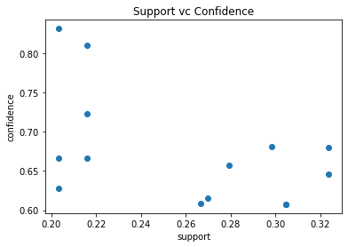
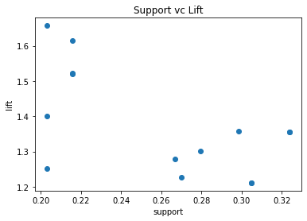
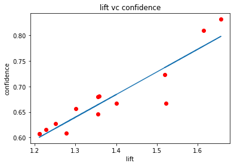

# Frequent Pattern Mining

```python
import numpy as np
import pandas as pd

#df = pd.read_csv('frequent.csv', sep=',')
df = pd.read_csv('Untitled.csv', sep=',') #Group A
df
```


<div>
<table border="1" class="dataframe">
  <thead>
    <tr style="text-align: right;">
      <th></th>
      <th>0</th>
      <th>1</th>
      <th>2</th>
      <th>3</th>
      <th>4</th>
    </tr>
  </thead>
  <tbody>
    <tr>
      <th>0</th>
      <td>Bread</td>
      <td>Cheese</td>
      <td>Meat</td>
      <td>Water</td>
      <td>Coffee</td>
    </tr>
    <tr>
      <th>1</th>
      <td>Wine</td>
      <td>Cheese</td>
      <td>Meat</td>
      <td>NaN</td>
      <td>NaN</td>
    </tr>
    <tr>
      <th>2</th>
      <td>Bread</td>
      <td>Beer</td>
      <td>Sugar</td>
      <td>NaN</td>
      <td>NaN</td>
    </tr>
    <tr>
      <th>3</th>
      <td>Wine</td>
      <td>Bread</td>
      <td>Butter</td>
      <td>Coffee</td>
      <td>NaN</td>
    </tr>
    <tr>
      <th>4</th>
      <td>Cheese</td>
      <td>Meat</td>
      <td>Beer</td>
      <td>NaN</td>
      <td>NaN</td>
    </tr>
    <tr>
      <th>5</th>
      <td>Bread</td>
      <td>Wine</td>
      <td>Cheese</td>
      <td>NaN</td>
      <td>NaN</td>
    </tr>
    <tr>
      <th>6</th>
      <td>Bread</td>
      <td>Wine</td>
      <td>Eggs</td>
      <td>Meat</td>
      <td>Cheese</td>
    </tr>
    <tr>
      <th>7</th>
      <td>Meat</td>
      <td>Wine</td>
      <td>Butter</td>
      <td>NaN</td>
      <td>NaN</td>
    </tr>
    <tr>
      <th>8</th>
      <td>Cheese</td>
      <td>Meat</td>
      <td>Wine</td>
      <td>NaN</td>
      <td>NaN</td>
    </tr>
    <tr>
      <th>9</th>
      <td>Cheese</td>
      <td>Water</td>
      <td>Eggs</td>
      <td>Sugar</td>
      <td>NaN</td>
    </tr>
  </tbody>
</table>
</div>


```python
items = set()
for c in df:
    items.update(df[c].unique())
    
print(items)
```

    {nan, 'Beer', 'Butter', 'Eggs', 'Coffee', 'Sugar', 'Meat', 'Water', 'Wine', 'Cheese', 'Bread'}


```python
items = [x for x in items if not pd.isnull(x)]
print(items)
```

    ['Beer', 'Butter', 'Eggs', 'Coffee', 'Sugar', 'Meat', 'Water', 'Wine', 'Cheese', 'Bread']


```python
pd.get_dummies(df)
```


<div>
<table border="1" class="dataframe">
  <thead>
    <tr style="text-align: right;">
      <th></th>
      <th>0_Bread</th>
      <th>0_Cheese</th>
      <th>0_Meat</th>
      <th>0_Wine</th>
      <th>1_Beer</th>
      <th>1_Bread</th>
      <th>1_Cheese</th>
      <th>1_Meat</th>
      <th>1_Water</th>
      <th>1_Wine</th>
      <th>...</th>
      <th>2_Eggs</th>
      <th>2_Meat</th>
      <th>2_Sugar</th>
      <th>2_Wine</th>
      <th>3_Coffee</th>
      <th>3_Meat</th>
      <th>3_Sugar</th>
      <th>3_Water</th>
      <th>4_Cheese</th>
      <th>4_Coffee</th>
    </tr>
  </thead>
  <tbody>
    <tr>
      <th>0</th>
      <td>1</td>
      <td>0</td>
      <td>0</td>
      <td>0</td>
      <td>0</td>
      <td>0</td>
      <td>1</td>
      <td>0</td>
      <td>0</td>
      <td>0</td>
      <td>...</td>
      <td>0</td>
      <td>1</td>
      <td>0</td>
      <td>0</td>
      <td>0</td>
      <td>0</td>
      <td>0</td>
      <td>1</td>
      <td>0</td>
      <td>1</td>
    </tr>
    <tr>
      <th>1</th>
      <td>0</td>
      <td>0</td>
      <td>0</td>
      <td>1</td>
      <td>0</td>
      <td>0</td>
      <td>1</td>
      <td>0</td>
      <td>0</td>
      <td>0</td>
      <td>...</td>
      <td>0</td>
      <td>1</td>
      <td>0</td>
      <td>0</td>
      <td>0</td>
      <td>0</td>
      <td>0</td>
      <td>0</td>
      <td>0</td>
      <td>0</td>
    </tr>
    <tr>
      <th>2</th>
      <td>1</td>
      <td>0</td>
      <td>0</td>
      <td>0</td>
      <td>1</td>
      <td>0</td>
      <td>0</td>
      <td>0</td>
      <td>0</td>
      <td>0</td>
      <td>...</td>
      <td>0</td>
      <td>0</td>
      <td>1</td>
      <td>0</td>
      <td>0</td>
      <td>0</td>
      <td>0</td>
      <td>0</td>
      <td>0</td>
      <td>0</td>
    </tr>
    <tr>
      <th>3</th>
      <td>0</td>
      <td>0</td>
      <td>0</td>
      <td>1</td>
      <td>0</td>
      <td>1</td>
      <td>0</td>
      <td>0</td>
      <td>0</td>
      <td>0</td>
      <td>...</td>
      <td>0</td>
      <td>0</td>
      <td>0</td>
      <td>0</td>
      <td>1</td>
      <td>0</td>
      <td>0</td>
      <td>0</td>
      <td>0</td>
      <td>0</td>
    </tr>
    <tr>
      <th>4</th>
      <td>0</td>
      <td>1</td>
      <td>0</td>
      <td>0</td>
      <td>0</td>
      <td>0</td>
      <td>0</td>
      <td>1</td>
      <td>0</td>
      <td>0</td>
      <td>...</td>
      <td>0</td>
      <td>0</td>
      <td>0</td>
      <td>0</td>
      <td>0</td>
      <td>0</td>
      <td>0</td>
      <td>0</td>
      <td>0</td>
      <td>0</td>
    </tr>
    <tr>
      <th>5</th>
      <td>1</td>
      <td>0</td>
      <td>0</td>
      <td>0</td>
      <td>0</td>
      <td>0</td>
      <td>0</td>
      <td>0</td>
      <td>0</td>
      <td>1</td>
      <td>...</td>
      <td>0</td>
      <td>0</td>
      <td>0</td>
      <td>0</td>
      <td>0</td>
      <td>0</td>
      <td>0</td>
      <td>0</td>
      <td>0</td>
      <td>0</td>
    </tr>
    <tr>
      <th>6</th>
      <td>1</td>
      <td>0</td>
      <td>0</td>
      <td>0</td>
      <td>0</td>
      <td>0</td>
      <td>0</td>
      <td>0</td>
      <td>0</td>
      <td>1</td>
      <td>...</td>
      <td>1</td>
      <td>0</td>
      <td>0</td>
      <td>0</td>
      <td>0</td>
      <td>1</td>
      <td>0</td>
      <td>0</td>
      <td>1</td>
      <td>0</td>
    </tr>
    <tr>
      <th>7</th>
      <td>0</td>
      <td>0</td>
      <td>1</td>
      <td>0</td>
      <td>0</td>
      <td>0</td>
      <td>0</td>
      <td>0</td>
      <td>0</td>
      <td>1</td>
      <td>...</td>
      <td>0</td>
      <td>0</td>
      <td>0</td>
      <td>0</td>
      <td>0</td>
      <td>0</td>
      <td>0</td>
      <td>0</td>
      <td>0</td>
      <td>0</td>
    </tr>
    <tr>
      <th>8</th>
      <td>0</td>
      <td>1</td>
      <td>0</td>
      <td>0</td>
      <td>0</td>
      <td>0</td>
      <td>0</td>
      <td>1</td>
      <td>0</td>
      <td>0</td>
      <td>...</td>
      <td>0</td>
      <td>0</td>
      <td>0</td>
      <td>1</td>
      <td>0</td>
      <td>0</td>
      <td>0</td>
      <td>0</td>
      <td>0</td>
      <td>0</td>
    </tr>
    <tr>
      <th>9</th>
      <td>0</td>
      <td>1</td>
      <td>0</td>
      <td>0</td>
      <td>0</td>
      <td>0</td>
      <td>0</td>
      <td>0</td>
      <td>1</td>
      <td>0</td>
      <td>...</td>
      <td>1</td>
      <td>0</td>
      <td>0</td>
      <td>0</td>
      <td>0</td>
      <td>0</td>
      <td>1</td>
      <td>0</td>
      <td>0</td>
      <td>0</td>
    </tr>
  </tbody>
</table>
<p>10 rows × 23 columns</p>
</div>


```python
from sklearn.preprocessing import OneHotEncoder

encoder = OneHotEncoder(sparse=False)
x = encoder.fit_transform(df)
pd.DataFrame(x)
```


<div>
<table border="1" class="dataframe">
  <thead>
    <tr style="text-align: right;">
      <th></th>
      <th>0</th>
      <th>1</th>
      <th>2</th>
      <th>3</th>
      <th>4</th>
      <th>5</th>
      <th>6</th>
      <th>7</th>
      <th>8</th>
      <th>9</th>
      <th>...</th>
      <th>15</th>
      <th>16</th>
      <th>17</th>
      <th>18</th>
      <th>19</th>
      <th>20</th>
      <th>21</th>
      <th>22</th>
      <th>23</th>
      <th>24</th>
    </tr>
  </thead>
  <tbody>
    <tr>
      <th>0</th>
      <td>1.0</td>
      <td>0.0</td>
      <td>0.0</td>
      <td>0.0</td>
      <td>0.0</td>
      <td>0.0</td>
      <td>1.0</td>
      <td>0.0</td>
      <td>0.0</td>
      <td>0.0</td>
      <td>...</td>
      <td>0.0</td>
      <td>0.0</td>
      <td>0.0</td>
      <td>0.0</td>
      <td>0.0</td>
      <td>1.0</td>
      <td>0.0</td>
      <td>0.0</td>
      <td>1.0</td>
      <td>0.0</td>
    </tr>
    <tr>
      <th>1</th>
      <td>0.0</td>
      <td>0.0</td>
      <td>0.0</td>
      <td>1.0</td>
      <td>0.0</td>
      <td>0.0</td>
      <td>1.0</td>
      <td>0.0</td>
      <td>0.0</td>
      <td>0.0</td>
      <td>...</td>
      <td>0.0</td>
      <td>0.0</td>
      <td>0.0</td>
      <td>0.0</td>
      <td>0.0</td>
      <td>0.0</td>
      <td>1.0</td>
      <td>0.0</td>
      <td>0.0</td>
      <td>1.0</td>
    </tr>
    <tr>
      <th>2</th>
      <td>1.0</td>
      <td>0.0</td>
      <td>0.0</td>
      <td>0.0</td>
      <td>1.0</td>
      <td>0.0</td>
      <td>0.0</td>
      <td>0.0</td>
      <td>0.0</td>
      <td>0.0</td>
      <td>...</td>
      <td>1.0</td>
      <td>0.0</td>
      <td>0.0</td>
      <td>0.0</td>
      <td>0.0</td>
      <td>0.0</td>
      <td>1.0</td>
      <td>0.0</td>
      <td>0.0</td>
      <td>1.0</td>
    </tr>
    <tr>
      <th>3</th>
      <td>0.0</td>
      <td>0.0</td>
      <td>0.0</td>
      <td>1.0</td>
      <td>0.0</td>
      <td>1.0</td>
      <td>0.0</td>
      <td>0.0</td>
      <td>0.0</td>
      <td>0.0</td>
      <td>...</td>
      <td>0.0</td>
      <td>0.0</td>
      <td>1.0</td>
      <td>0.0</td>
      <td>0.0</td>
      <td>0.0</td>
      <td>0.0</td>
      <td>0.0</td>
      <td>0.0</td>
      <td>1.0</td>
    </tr>
    <tr>
      <th>4</th>
      <td>0.0</td>
      <td>1.0</td>
      <td>0.0</td>
      <td>0.0</td>
      <td>0.0</td>
      <td>0.0</td>
      <td>0.0</td>
      <td>1.0</td>
      <td>0.0</td>
      <td>0.0</td>
      <td>...</td>
      <td>0.0</td>
      <td>0.0</td>
      <td>0.0</td>
      <td>0.0</td>
      <td>0.0</td>
      <td>0.0</td>
      <td>1.0</td>
      <td>0.0</td>
      <td>0.0</td>
      <td>1.0</td>
    </tr>
    <tr>
      <th>5</th>
      <td>1.0</td>
      <td>0.0</td>
      <td>0.0</td>
      <td>0.0</td>
      <td>0.0</td>
      <td>0.0</td>
      <td>0.0</td>
      <td>0.0</td>
      <td>0.0</td>
      <td>1.0</td>
      <td>...</td>
      <td>0.0</td>
      <td>0.0</td>
      <td>0.0</td>
      <td>0.0</td>
      <td>0.0</td>
      <td>0.0</td>
      <td>1.0</td>
      <td>0.0</td>
      <td>0.0</td>
      <td>1.0</td>
    </tr>
    <tr>
      <th>6</th>
      <td>1.0</td>
      <td>0.0</td>
      <td>0.0</td>
      <td>0.0</td>
      <td>0.0</td>
      <td>0.0</td>
      <td>0.0</td>
      <td>0.0</td>
      <td>0.0</td>
      <td>1.0</td>
      <td>...</td>
      <td>0.0</td>
      <td>0.0</td>
      <td>0.0</td>
      <td>1.0</td>
      <td>0.0</td>
      <td>0.0</td>
      <td>0.0</td>
      <td>1.0</td>
      <td>0.0</td>
      <td>0.0</td>
    </tr>
    <tr>
      <th>7</th>
      <td>0.0</td>
      <td>0.0</td>
      <td>1.0</td>
      <td>0.0</td>
      <td>0.0</td>
      <td>0.0</td>
      <td>0.0</td>
      <td>0.0</td>
      <td>0.0</td>
      <td>1.0</td>
      <td>...</td>
      <td>0.0</td>
      <td>0.0</td>
      <td>0.0</td>
      <td>0.0</td>
      <td>0.0</td>
      <td>0.0</td>
      <td>1.0</td>
      <td>0.0</td>
      <td>0.0</td>
      <td>1.0</td>
    </tr>
    <tr>
      <th>8</th>
      <td>0.0</td>
      <td>1.0</td>
      <td>0.0</td>
      <td>0.0</td>
      <td>0.0</td>
      <td>0.0</td>
      <td>0.0</td>
      <td>1.0</td>
      <td>0.0</td>
      <td>0.0</td>
      <td>...</td>
      <td>0.0</td>
      <td>1.0</td>
      <td>0.0</td>
      <td>0.0</td>
      <td>0.0</td>
      <td>0.0</td>
      <td>1.0</td>
      <td>0.0</td>
      <td>0.0</td>
      <td>1.0</td>
    </tr>
    <tr>
      <th>9</th>
      <td>0.0</td>
      <td>1.0</td>
      <td>0.0</td>
      <td>0.0</td>
      <td>0.0</td>
      <td>0.0</td>
      <td>0.0</td>
      <td>0.0</td>
      <td>1.0</td>
      <td>0.0</td>
      <td>...</td>
      <td>0.0</td>
      <td>0.0</td>
      <td>0.0</td>
      <td>0.0</td>
      <td>1.0</td>
      <td>0.0</td>
      <td>0.0</td>
      <td>0.0</td>
      <td>0.0</td>
      <td>1.0</td>
    </tr>
  </tbody>
</table>
<p>10 rows × 25 columns</p>
</div>


```python
columnNames = encoder.get_feature_names()
columnNames
```


    array(['x0_Bread', 'x0_Cheese', 'x0_Meat', 'x0_Wine', 'x1_Beer',
           'x1_Bread', 'x1_Cheese', 'x1_Meat', 'x1_Water', 'x1_Wine',
           'x2_Beer', 'x2_Butter', 'x2_Cheese', 'x2_Eggs', 'x2_Meat',
           'x2_Sugar', 'x2_Wine', 'x3_Coffee', 'x3_Meat', 'x3_Sugar',
           'x3_Water', 'x3_nan', 'x4_Cheese', 'x4_Coffee', 'x4_nan'],
          dtype=object)


```python
itemset = pd.DataFrame(x, columns=columnNames)

itemset
```


<div>
<table border="1" class="dataframe">
  <thead>
    <tr style="text-align: right;">
      <th></th>
      <th>x0_Bread</th>
      <th>x0_Cheese</th>
      <th>x0_Meat</th>
      <th>x0_Wine</th>
      <th>x1_Beer</th>
      <th>x1_Bread</th>
      <th>x1_Cheese</th>
      <th>x1_Meat</th>
      <th>x1_Water</th>
      <th>x1_Wine</th>
      <th>...</th>
      <th>x2_Sugar</th>
      <th>x2_Wine</th>
      <th>x3_Coffee</th>
      <th>x3_Meat</th>
      <th>x3_Sugar</th>
      <th>x3_Water</th>
      <th>x3_nan</th>
      <th>x4_Cheese</th>
      <th>x4_Coffee</th>
      <th>x4_nan</th>
    </tr>
  </thead>
  <tbody>
    <tr>
      <th>0</th>
      <td>1.0</td>
      <td>0.0</td>
      <td>0.0</td>
      <td>0.0</td>
      <td>0.0</td>
      <td>0.0</td>
      <td>1.0</td>
      <td>0.0</td>
      <td>0.0</td>
      <td>0.0</td>
      <td>...</td>
      <td>0.0</td>
      <td>0.0</td>
      <td>0.0</td>
      <td>0.0</td>
      <td>0.0</td>
      <td>1.0</td>
      <td>0.0</td>
      <td>0.0</td>
      <td>1.0</td>
      <td>0.0</td>
    </tr>
    <tr>
      <th>1</th>
      <td>0.0</td>
      <td>0.0</td>
      <td>0.0</td>
      <td>1.0</td>
      <td>0.0</td>
      <td>0.0</td>
      <td>1.0</td>
      <td>0.0</td>
      <td>0.0</td>
      <td>0.0</td>
      <td>...</td>
      <td>0.0</td>
      <td>0.0</td>
      <td>0.0</td>
      <td>0.0</td>
      <td>0.0</td>
      <td>0.0</td>
      <td>1.0</td>
      <td>0.0</td>
      <td>0.0</td>
      <td>1.0</td>
    </tr>
    <tr>
      <th>2</th>
      <td>1.0</td>
      <td>0.0</td>
      <td>0.0</td>
      <td>0.0</td>
      <td>1.0</td>
      <td>0.0</td>
      <td>0.0</td>
      <td>0.0</td>
      <td>0.0</td>
      <td>0.0</td>
      <td>...</td>
      <td>1.0</td>
      <td>0.0</td>
      <td>0.0</td>
      <td>0.0</td>
      <td>0.0</td>
      <td>0.0</td>
      <td>1.0</td>
      <td>0.0</td>
      <td>0.0</td>
      <td>1.0</td>
    </tr>
    <tr>
      <th>3</th>
      <td>0.0</td>
      <td>0.0</td>
      <td>0.0</td>
      <td>1.0</td>
      <td>0.0</td>
      <td>1.0</td>
      <td>0.0</td>
      <td>0.0</td>
      <td>0.0</td>
      <td>0.0</td>
      <td>...</td>
      <td>0.0</td>
      <td>0.0</td>
      <td>1.0</td>
      <td>0.0</td>
      <td>0.0</td>
      <td>0.0</td>
      <td>0.0</td>
      <td>0.0</td>
      <td>0.0</td>
      <td>1.0</td>
    </tr>
    <tr>
      <th>4</th>
      <td>0.0</td>
      <td>1.0</td>
      <td>0.0</td>
      <td>0.0</td>
      <td>0.0</td>
      <td>0.0</td>
      <td>0.0</td>
      <td>1.0</td>
      <td>0.0</td>
      <td>0.0</td>
      <td>...</td>
      <td>0.0</td>
      <td>0.0</td>
      <td>0.0</td>
      <td>0.0</td>
      <td>0.0</td>
      <td>0.0</td>
      <td>1.0</td>
      <td>0.0</td>
      <td>0.0</td>
      <td>1.0</td>
    </tr>
    <tr>
      <th>5</th>
      <td>1.0</td>
      <td>0.0</td>
      <td>0.0</td>
      <td>0.0</td>
      <td>0.0</td>
      <td>0.0</td>
      <td>0.0</td>
      <td>0.0</td>
      <td>0.0</td>
      <td>1.0</td>
      <td>...</td>
      <td>0.0</td>
      <td>0.0</td>
      <td>0.0</td>
      <td>0.0</td>
      <td>0.0</td>
      <td>0.0</td>
      <td>1.0</td>
      <td>0.0</td>
      <td>0.0</td>
      <td>1.0</td>
    </tr>
    <tr>
      <th>6</th>
      <td>1.0</td>
      <td>0.0</td>
      <td>0.0</td>
      <td>0.0</td>
      <td>0.0</td>
      <td>0.0</td>
      <td>0.0</td>
      <td>0.0</td>
      <td>0.0</td>
      <td>1.0</td>
      <td>...</td>
      <td>0.0</td>
      <td>0.0</td>
      <td>0.0</td>
      <td>1.0</td>
      <td>0.0</td>
      <td>0.0</td>
      <td>0.0</td>
      <td>1.0</td>
      <td>0.0</td>
      <td>0.0</td>
    </tr>
    <tr>
      <th>7</th>
      <td>0.0</td>
      <td>0.0</td>
      <td>1.0</td>
      <td>0.0</td>
      <td>0.0</td>
      <td>0.0</td>
      <td>0.0</td>
      <td>0.0</td>
      <td>0.0</td>
      <td>1.0</td>
      <td>...</td>
      <td>0.0</td>
      <td>0.0</td>
      <td>0.0</td>
      <td>0.0</td>
      <td>0.0</td>
      <td>0.0</td>
      <td>1.0</td>
      <td>0.0</td>
      <td>0.0</td>
      <td>1.0</td>
    </tr>
    <tr>
      <th>8</th>
      <td>0.0</td>
      <td>1.0</td>
      <td>0.0</td>
      <td>0.0</td>
      <td>0.0</td>
      <td>0.0</td>
      <td>0.0</td>
      <td>1.0</td>
      <td>0.0</td>
      <td>0.0</td>
      <td>...</td>
      <td>0.0</td>
      <td>1.0</td>
      <td>0.0</td>
      <td>0.0</td>
      <td>0.0</td>
      <td>0.0</td>
      <td>1.0</td>
      <td>0.0</td>
      <td>0.0</td>
      <td>1.0</td>
    </tr>
    <tr>
      <th>9</th>
      <td>0.0</td>
      <td>1.0</td>
      <td>0.0</td>
      <td>0.0</td>
      <td>0.0</td>
      <td>0.0</td>
      <td>0.0</td>
      <td>0.0</td>
      <td>1.0</td>
      <td>0.0</td>
      <td>...</td>
      <td>0.0</td>
      <td>0.0</td>
      <td>0.0</td>
      <td>0.0</td>
      <td>1.0</td>
      <td>0.0</td>
      <td>0.0</td>
      <td>0.0</td>
      <td>0.0</td>
      <td>1.0</td>
    </tr>
  </tbody>
</table>
<p>10 rows × 25 columns</p>
</div>


```python
from mlxtend.frequent_patterns import apriori

freq_items = apriori(itemset, min_support=0.2, use_colnames=True, verbose=1)
freq_items
```

    Processing 4 combinations | Sampling itemset size 4


<div>
<table border="1" class="dataframe">
  <thead>
    <tr style="text-align: right;">
      <th></th>
      <th>support</th>
      <th>itemsets</th>
    </tr>
  </thead>
  <tbody>
    <tr>
      <th>0</th>
      <td>0.4</td>
      <td>(x0_Bread)</td>
    </tr>
    <tr>
      <th>1</th>
      <td>0.3</td>
      <td>(x0_Cheese)</td>
    </tr>
    <tr>
      <th>2</th>
      <td>0.2</td>
      <td>(x0_Wine)</td>
    </tr>
    <tr>
      <th>3</th>
      <td>0.2</td>
      <td>(x1_Cheese)</td>
    </tr>
    <tr>
      <th>4</th>
      <td>0.2</td>
      <td>(x1_Meat)</td>
    </tr>
    <tr>
      <th>5</th>
      <td>0.3</td>
      <td>(x1_Wine)</td>
    </tr>
    <tr>
      <th>6</th>
      <td>0.2</td>
      <td>(x2_Butter)</td>
    </tr>
    <tr>
      <th>7</th>
      <td>0.2</td>
      <td>(x2_Eggs)</td>
    </tr>
    <tr>
      <th>8</th>
      <td>0.2</td>
      <td>(x2_Meat)</td>
    </tr>
    <tr>
      <th>9</th>
      <td>0.6</td>
      <td>(x3_nan)</td>
    </tr>
    <tr>
      <th>10</th>
      <td>0.8</td>
      <td>(x4_nan)</td>
    </tr>
    <tr>
      <th>11</th>
      <td>0.2</td>
      <td>(x0_Bread, x1_Wine)</td>
    </tr>
    <tr>
      <th>12</th>
      <td>0.2</td>
      <td>(x0_Bread, x3_nan)</td>
    </tr>
    <tr>
      <th>13</th>
      <td>0.2</td>
      <td>(x4_nan, x0_Bread)</td>
    </tr>
    <tr>
      <th>14</th>
      <td>0.2</td>
      <td>(x1_Meat, x0_Cheese)</td>
    </tr>
    <tr>
      <th>15</th>
      <td>0.2</td>
      <td>(x0_Cheese, x3_nan)</td>
    </tr>
    <tr>
      <th>16</th>
      <td>0.3</td>
      <td>(x4_nan, x0_Cheese)</td>
    </tr>
    <tr>
      <th>17</th>
      <td>0.2</td>
      <td>(x4_nan, x0_Wine)</td>
    </tr>
    <tr>
      <th>18</th>
      <td>0.2</td>
      <td>(x2_Meat, x1_Cheese)</td>
    </tr>
    <tr>
      <th>19</th>
      <td>0.2</td>
      <td>(x1_Meat, x3_nan)</td>
    </tr>
    <tr>
      <th>20</th>
      <td>0.2</td>
      <td>(x4_nan, x1_Meat)</td>
    </tr>
    <tr>
      <th>21</th>
      <td>0.2</td>
      <td>(x1_Wine, x3_nan)</td>
    </tr>
    <tr>
      <th>22</th>
      <td>0.2</td>
      <td>(x4_nan, x1_Wine)</td>
    </tr>
    <tr>
      <th>23</th>
      <td>0.2</td>
      <td>(x4_nan, x2_Butter)</td>
    </tr>
    <tr>
      <th>24</th>
      <td>0.6</td>
      <td>(x4_nan, x3_nan)</td>
    </tr>
    <tr>
      <th>25</th>
      <td>0.2</td>
      <td>(x4_nan, x0_Bread, x3_nan)</td>
    </tr>
    <tr>
      <th>26</th>
      <td>0.2</td>
      <td>(x1_Meat, x0_Cheese, x3_nan)</td>
    </tr>
    <tr>
      <th>27</th>
      <td>0.2</td>
      <td>(x4_nan, x1_Meat, x0_Cheese)</td>
    </tr>
    <tr>
      <th>28</th>
      <td>0.2</td>
      <td>(x4_nan, x0_Cheese, x3_nan)</td>
    </tr>
    <tr>
      <th>29</th>
      <td>0.2</td>
      <td>(x4_nan, x1_Meat, x3_nan)</td>
    </tr>
    <tr>
      <th>30</th>
      <td>0.2</td>
      <td>(x4_nan, x1_Wine, x3_nan)</td>
    </tr>
    <tr>
      <th>31</th>
      <td>0.2</td>
      <td>(x4_nan, x1_Meat, x0_Cheese, x3_nan)</td>
    </tr>
  </tbody>
</table>
</div>


```python
nans = [c for c in itemset.columns if c.find('_nan')>-1]
nans
```


    ['x3_nan', 'x4_nan']


```python
itemset = itemset.drop(nans, axis=1)
itemset
```


<div>
<table border="1" class="dataframe">
  <thead>
    <tr style="text-align: right;">
      <th></th>
      <th>x0_Bread</th>
      <th>x0_Cheese</th>
      <th>x0_Meat</th>
      <th>x0_Wine</th>
      <th>x1_Beer</th>
      <th>x1_Bread</th>
      <th>x1_Cheese</th>
      <th>x1_Meat</th>
      <th>x1_Water</th>
      <th>x1_Wine</th>
      <th>...</th>
      <th>x2_Eggs</th>
      <th>x2_Meat</th>
      <th>x2_Sugar</th>
      <th>x2_Wine</th>
      <th>x3_Coffee</th>
      <th>x3_Meat</th>
      <th>x3_Sugar</th>
      <th>x3_Water</th>
      <th>x4_Cheese</th>
      <th>x4_Coffee</th>
    </tr>
  </thead>
  <tbody>
    <tr>
      <th>0</th>
      <td>1.0</td>
      <td>0.0</td>
      <td>0.0</td>
      <td>0.0</td>
      <td>0.0</td>
      <td>0.0</td>
      <td>1.0</td>
      <td>0.0</td>
      <td>0.0</td>
      <td>0.0</td>
      <td>...</td>
      <td>0.0</td>
      <td>1.0</td>
      <td>0.0</td>
      <td>0.0</td>
      <td>0.0</td>
      <td>0.0</td>
      <td>0.0</td>
      <td>1.0</td>
      <td>0.0</td>
      <td>1.0</td>
    </tr>
    <tr>
      <th>1</th>
      <td>0.0</td>
      <td>0.0</td>
      <td>0.0</td>
      <td>1.0</td>
      <td>0.0</td>
      <td>0.0</td>
      <td>1.0</td>
      <td>0.0</td>
      <td>0.0</td>
      <td>0.0</td>
      <td>...</td>
      <td>0.0</td>
      <td>1.0</td>
      <td>0.0</td>
      <td>0.0</td>
      <td>0.0</td>
      <td>0.0</td>
      <td>0.0</td>
      <td>0.0</td>
      <td>0.0</td>
      <td>0.0</td>
    </tr>
    <tr>
      <th>2</th>
      <td>1.0</td>
      <td>0.0</td>
      <td>0.0</td>
      <td>0.0</td>
      <td>1.0</td>
      <td>0.0</td>
      <td>0.0</td>
      <td>0.0</td>
      <td>0.0</td>
      <td>0.0</td>
      <td>...</td>
      <td>0.0</td>
      <td>0.0</td>
      <td>1.0</td>
      <td>0.0</td>
      <td>0.0</td>
      <td>0.0</td>
      <td>0.0</td>
      <td>0.0</td>
      <td>0.0</td>
      <td>0.0</td>
    </tr>
    <tr>
      <th>3</th>
      <td>0.0</td>
      <td>0.0</td>
      <td>0.0</td>
      <td>1.0</td>
      <td>0.0</td>
      <td>1.0</td>
      <td>0.0</td>
      <td>0.0</td>
      <td>0.0</td>
      <td>0.0</td>
      <td>...</td>
      <td>0.0</td>
      <td>0.0</td>
      <td>0.0</td>
      <td>0.0</td>
      <td>1.0</td>
      <td>0.0</td>
      <td>0.0</td>
      <td>0.0</td>
      <td>0.0</td>
      <td>0.0</td>
    </tr>
    <tr>
      <th>4</th>
      <td>0.0</td>
      <td>1.0</td>
      <td>0.0</td>
      <td>0.0</td>
      <td>0.0</td>
      <td>0.0</td>
      <td>0.0</td>
      <td>1.0</td>
      <td>0.0</td>
      <td>0.0</td>
      <td>...</td>
      <td>0.0</td>
      <td>0.0</td>
      <td>0.0</td>
      <td>0.0</td>
      <td>0.0</td>
      <td>0.0</td>
      <td>0.0</td>
      <td>0.0</td>
      <td>0.0</td>
      <td>0.0</td>
    </tr>
    <tr>
      <th>5</th>
      <td>1.0</td>
      <td>0.0</td>
      <td>0.0</td>
      <td>0.0</td>
      <td>0.0</td>
      <td>0.0</td>
      <td>0.0</td>
      <td>0.0</td>
      <td>0.0</td>
      <td>1.0</td>
      <td>...</td>
      <td>0.0</td>
      <td>0.0</td>
      <td>0.0</td>
      <td>0.0</td>
      <td>0.0</td>
      <td>0.0</td>
      <td>0.0</td>
      <td>0.0</td>
      <td>0.0</td>
      <td>0.0</td>
    </tr>
    <tr>
      <th>6</th>
      <td>1.0</td>
      <td>0.0</td>
      <td>0.0</td>
      <td>0.0</td>
      <td>0.0</td>
      <td>0.0</td>
      <td>0.0</td>
      <td>0.0</td>
      <td>0.0</td>
      <td>1.0</td>
      <td>...</td>
      <td>1.0</td>
      <td>0.0</td>
      <td>0.0</td>
      <td>0.0</td>
      <td>0.0</td>
      <td>1.0</td>
      <td>0.0</td>
      <td>0.0</td>
      <td>1.0</td>
      <td>0.0</td>
    </tr>
    <tr>
      <th>7</th>
      <td>0.0</td>
      <td>0.0</td>
      <td>1.0</td>
      <td>0.0</td>
      <td>0.0</td>
      <td>0.0</td>
      <td>0.0</td>
      <td>0.0</td>
      <td>0.0</td>
      <td>1.0</td>
      <td>...</td>
      <td>0.0</td>
      <td>0.0</td>
      <td>0.0</td>
      <td>0.0</td>
      <td>0.0</td>
      <td>0.0</td>
      <td>0.0</td>
      <td>0.0</td>
      <td>0.0</td>
      <td>0.0</td>
    </tr>
    <tr>
      <th>8</th>
      <td>0.0</td>
      <td>1.0</td>
      <td>0.0</td>
      <td>0.0</td>
      <td>0.0</td>
      <td>0.0</td>
      <td>0.0</td>
      <td>1.0</td>
      <td>0.0</td>
      <td>0.0</td>
      <td>...</td>
      <td>0.0</td>
      <td>0.0</td>
      <td>0.0</td>
      <td>1.0</td>
      <td>0.0</td>
      <td>0.0</td>
      <td>0.0</td>
      <td>0.0</td>
      <td>0.0</td>
      <td>0.0</td>
    </tr>
    <tr>
      <th>9</th>
      <td>0.0</td>
      <td>1.0</td>
      <td>0.0</td>
      <td>0.0</td>
      <td>0.0</td>
      <td>0.0</td>
      <td>0.0</td>
      <td>0.0</td>
      <td>1.0</td>
      <td>0.0</td>
      <td>...</td>
      <td>1.0</td>
      <td>0.0</td>
      <td>0.0</td>
      <td>0.0</td>
      <td>0.0</td>
      <td>0.0</td>
      <td>1.0</td>
      <td>0.0</td>
      <td>0.0</td>
      <td>0.0</td>
    </tr>
  </tbody>
</table>
<p>10 rows × 23 columns</p>
</div>


```python
freq_items = apriori(itemset, min_support=0.2, use_colnames=True, verbose=1)
freq_items
```

    Processing 9 combinations | Sampling itemset size 3


<div>
<table border="1" class="dataframe">
  <thead>
    <tr style="text-align: right;">
      <th></th>
      <th>support</th>
      <th>itemsets</th>
    </tr>
  </thead>
  <tbody>
    <tr>
      <th>0</th>
      <td>0.4</td>
      <td>(x0_Bread)</td>
    </tr>
    <tr>
      <th>1</th>
      <td>0.3</td>
      <td>(x0_Cheese)</td>
    </tr>
    <tr>
      <th>2</th>
      <td>0.2</td>
      <td>(x0_Wine)</td>
    </tr>
    <tr>
      <th>3</th>
      <td>0.2</td>
      <td>(x1_Cheese)</td>
    </tr>
    <tr>
      <th>4</th>
      <td>0.2</td>
      <td>(x1_Meat)</td>
    </tr>
    <tr>
      <th>5</th>
      <td>0.3</td>
      <td>(x1_Wine)</td>
    </tr>
    <tr>
      <th>6</th>
      <td>0.2</td>
      <td>(x2_Butter)</td>
    </tr>
    <tr>
      <th>7</th>
      <td>0.2</td>
      <td>(x2_Eggs)</td>
    </tr>
    <tr>
      <th>8</th>
      <td>0.2</td>
      <td>(x2_Meat)</td>
    </tr>
    <tr>
      <th>9</th>
      <td>0.2</td>
      <td>(x0_Bread, x1_Wine)</td>
    </tr>
    <tr>
      <th>10</th>
      <td>0.2</td>
      <td>(x1_Meat, x0_Cheese)</td>
    </tr>
    <tr>
      <th>11</th>
      <td>0.2</td>
      <td>(x2_Meat, x1_Cheese)</td>
    </tr>
  </tbody>
</table>
</div>


```python
itemset = set(items)
encoded = []
for index, row in df.iterrows():
    rowset=set(row)
    labels={}
    uncommons = list(itemset-rowset)
    commons = list(itemset.intersection(rowset))
    for uc in uncommons:
        labels[uc] = 0
    for c in commons:
        labels[c] = 1
    encoded.append(labels)
    
data = pd.DataFrame(encoded)
data
```


<div>
<table border="1" class="dataframe">
  <thead>
    <tr style="text-align: right;">
      <th></th>
      <th>Beer</th>
      <th>Butter</th>
      <th>Eggs</th>
      <th>Sugar</th>
      <th>Wine</th>
      <th>Coffee</th>
      <th>Meat</th>
      <th>Bread</th>
      <th>Cheese</th>
      <th>Water</th>
    </tr>
  </thead>
  <tbody>
    <tr>
      <th>0</th>
      <td>0</td>
      <td>0</td>
      <td>0</td>
      <td>0</td>
      <td>0</td>
      <td>1</td>
      <td>1</td>
      <td>1</td>
      <td>1</td>
      <td>1</td>
    </tr>
    <tr>
      <th>1</th>
      <td>0</td>
      <td>0</td>
      <td>0</td>
      <td>0</td>
      <td>1</td>
      <td>0</td>
      <td>1</td>
      <td>0</td>
      <td>1</td>
      <td>0</td>
    </tr>
    <tr>
      <th>2</th>
      <td>1</td>
      <td>0</td>
      <td>0</td>
      <td>1</td>
      <td>0</td>
      <td>0</td>
      <td>0</td>
      <td>1</td>
      <td>0</td>
      <td>0</td>
    </tr>
    <tr>
      <th>3</th>
      <td>0</td>
      <td>1</td>
      <td>0</td>
      <td>0</td>
      <td>1</td>
      <td>1</td>
      <td>0</td>
      <td>1</td>
      <td>0</td>
      <td>0</td>
    </tr>
    <tr>
      <th>4</th>
      <td>1</td>
      <td>0</td>
      <td>0</td>
      <td>0</td>
      <td>0</td>
      <td>0</td>
      <td>1</td>
      <td>0</td>
      <td>1</td>
      <td>0</td>
    </tr>
    <tr>
      <th>5</th>
      <td>0</td>
      <td>0</td>
      <td>0</td>
      <td>0</td>
      <td>1</td>
      <td>0</td>
      <td>0</td>
      <td>1</td>
      <td>1</td>
      <td>0</td>
    </tr>
    <tr>
      <th>6</th>
      <td>0</td>
      <td>0</td>
      <td>1</td>
      <td>0</td>
      <td>1</td>
      <td>0</td>
      <td>1</td>
      <td>1</td>
      <td>1</td>
      <td>0</td>
    </tr>
    <tr>
      <th>7</th>
      <td>0</td>
      <td>1</td>
      <td>0</td>
      <td>0</td>
      <td>1</td>
      <td>0</td>
      <td>1</td>
      <td>0</td>
      <td>0</td>
      <td>0</td>
    </tr>
    <tr>
      <th>8</th>
      <td>0</td>
      <td>0</td>
      <td>0</td>
      <td>0</td>
      <td>1</td>
      <td>0</td>
      <td>1</td>
      <td>0</td>
      <td>1</td>
      <td>0</td>
    </tr>
    <tr>
      <th>9</th>
      <td>0</td>
      <td>0</td>
      <td>1</td>
      <td>1</td>
      <td>0</td>
      <td>0</td>
      <td>0</td>
      <td>0</td>
      <td>1</td>
      <td>1</td>
    </tr>
  </tbody>
</table>
</div>


```python
freq_items = apriori(data, min_support=0.3, use_colnames=True, verbose=1)
freq_items
```

    Processing 9 combinations | Sampling itemset size 3


<div>
<table border="1" class="dataframe">
  <thead>
    <tr style="text-align: right;">
      <th></th>
      <th>support</th>
      <th>itemsets</th>
    </tr>
  </thead>
  <tbody>
    <tr>
      <th>0</th>
      <td>0.6</td>
      <td>(Wine)</td>
    </tr>
    <tr>
      <th>1</th>
      <td>0.6</td>
      <td>(Meat)</td>
    </tr>
    <tr>
      <th>2</th>
      <td>0.5</td>
      <td>(Bread)</td>
    </tr>
    <tr>
      <th>3</th>
      <td>0.7</td>
      <td>(Cheese)</td>
    </tr>
    <tr>
      <th>4</th>
      <td>0.4</td>
      <td>(Wine, Meat)</td>
    </tr>
    <tr>
      <th>5</th>
      <td>0.3</td>
      <td>(Wine, Bread)</td>
    </tr>
    <tr>
      <th>6</th>
      <td>0.4</td>
      <td>(Wine, Cheese)</td>
    </tr>
    <tr>
      <th>7</th>
      <td>0.5</td>
      <td>(Meat, Cheese)</td>
    </tr>
    <tr>
      <th>8</th>
      <td>0.3</td>
      <td>(Cheese, Bread)</td>
    </tr>
    <tr>
      <th>9</th>
      <td>0.3</td>
      <td>(Wine, Meat, Cheese)</td>
    </tr>
  </tbody>
</table>
</div>


```python
from mlxtend.frequent_patterns import association_rules

rules = association_rules(freq_items, metric='confidence', min_threshold=0.6)
rules
```


<div>
<table border="1" class="dataframe">
  <thead>
    <tr style="text-align: right;">
      <th></th>
      <th>antecedents</th>
      <th>consequents</th>
      <th>antecedent support</th>
      <th>consequent support</th>
      <th>support</th>
      <th>confidence</th>
      <th>lift</th>
      <th>leverage</th>
      <th>conviction</th>
    </tr>
  </thead>
  <tbody>
    <tr>
      <th>0</th>
      <td>(Wine)</td>
      <td>(Meat)</td>
      <td>0.6</td>
      <td>0.6</td>
      <td>0.4</td>
      <td>0.666667</td>
      <td>1.111111</td>
      <td>0.04</td>
      <td>1.20</td>
    </tr>
    <tr>
      <th>1</th>
      <td>(Meat)</td>
      <td>(Wine)</td>
      <td>0.6</td>
      <td>0.6</td>
      <td>0.4</td>
      <td>0.666667</td>
      <td>1.111111</td>
      <td>0.04</td>
      <td>1.20</td>
    </tr>
    <tr>
      <th>2</th>
      <td>(Bread)</td>
      <td>(Wine)</td>
      <td>0.5</td>
      <td>0.6</td>
      <td>0.3</td>
      <td>0.600000</td>
      <td>1.000000</td>
      <td>0.00</td>
      <td>1.00</td>
    </tr>
    <tr>
      <th>3</th>
      <td>(Wine)</td>
      <td>(Cheese)</td>
      <td>0.6</td>
      <td>0.7</td>
      <td>0.4</td>
      <td>0.666667</td>
      <td>0.952381</td>
      <td>-0.02</td>
      <td>0.90</td>
    </tr>
    <tr>
      <th>4</th>
      <td>(Meat)</td>
      <td>(Cheese)</td>
      <td>0.6</td>
      <td>0.7</td>
      <td>0.5</td>
      <td>0.833333</td>
      <td>1.190476</td>
      <td>0.08</td>
      <td>1.80</td>
    </tr>
    <tr>
      <th>5</th>
      <td>(Cheese)</td>
      <td>(Meat)</td>
      <td>0.7</td>
      <td>0.6</td>
      <td>0.5</td>
      <td>0.714286</td>
      <td>1.190476</td>
      <td>0.08</td>
      <td>1.40</td>
    </tr>
    <tr>
      <th>6</th>
      <td>(Bread)</td>
      <td>(Cheese)</td>
      <td>0.5</td>
      <td>0.7</td>
      <td>0.3</td>
      <td>0.600000</td>
      <td>0.857143</td>
      <td>-0.05</td>
      <td>0.75</td>
    </tr>
    <tr>
      <th>7</th>
      <td>(Wine, Meat)</td>
      <td>(Cheese)</td>
      <td>0.4</td>
      <td>0.7</td>
      <td>0.3</td>
      <td>0.750000</td>
      <td>1.071429</td>
      <td>0.02</td>
      <td>1.20</td>
    </tr>
    <tr>
      <th>8</th>
      <td>(Wine, Cheese)</td>
      <td>(Meat)</td>
      <td>0.4</td>
      <td>0.6</td>
      <td>0.3</td>
      <td>0.750000</td>
      <td>1.250000</td>
      <td>0.06</td>
      <td>1.60</td>
    </tr>
    <tr>
      <th>9</th>
      <td>(Meat, Cheese)</td>
      <td>(Wine)</td>
      <td>0.5</td>
      <td>0.6</td>
      <td>0.3</td>
      <td>0.600000</td>
      <td>1.000000</td>
      <td>0.00</td>
      <td>1.00</td>
    </tr>
  </tbody>
</table>
</div>


```python

```


```python
import matplotlib.pyplot as plt

plt.scatter(rules['support'], rules['confidence'])
plt.xlabel('support')
plt.ylabel('confidence')
plt.title('Support vc Confidence')
plt.show()
```


    

    


```python
plt.scatter(rules['support'], rules['lift'])
plt.xlabel('support')
plt.ylabel('lift')
plt.title('Support vc Lift')
plt.show()
```


    

    


```python
fit = np.polyfit(rules['lift'], rules['confidence'], 1)
f = np.poly1d(fit)

plt.plot(rules['lift'], rules['confidence'], 'ro', rules['lift'], f(rules['lift']))
plt.xlabel('lift')
plt.ylabel('confidence')
plt.title('lift vc confidence')
plt.show()
```


    

   
