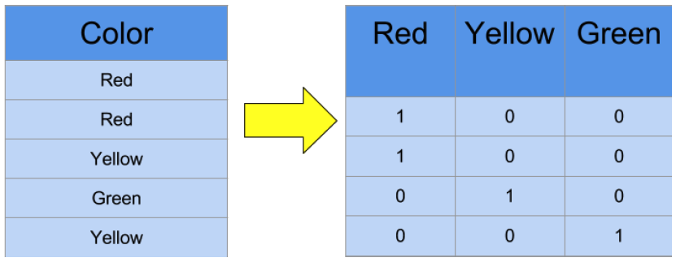

# Data Preprocessing

## Importing and Slicing


```python
import pandas as pd
import numpy as np
```


```python
dataset = pd.read_csv('Data.csv')
dataset
```


<div>
<table border="1" class="dataframe">
  <thead>
    <tr style="text-align: right;">
      <th></th>
      <th>Country</th>
      <th>Age</th>
      <th>Salary</th>
      <th>Purchased</th>
    </tr>
  </thead>
  <tbody>
    <tr>
      <th>0</th>
      <td>France</td>
      <td>44.0</td>
      <td>72000.0</td>
      <td>No</td>
    </tr>
    <tr>
      <th>1</th>
      <td>Spain</td>
      <td>27.0</td>
      <td>48000.0</td>
      <td>Yes</td>
    </tr>
    <tr>
      <th>2</th>
      <td>Germany</td>
      <td>30.0</td>
      <td>54000.0</td>
      <td>No</td>
    </tr>
    <tr>
      <th>3</th>
      <td>Spain</td>
      <td>38.0</td>
      <td>61000.0</td>
      <td>No</td>
    </tr>
    <tr>
      <th>4</th>
      <td>Germany</td>
      <td>40.0</td>
      <td>NaN</td>
      <td>Yes</td>
    </tr>
    <tr>
      <th>5</th>
      <td>France</td>
      <td>35.0</td>
      <td>58000.0</td>
      <td>Yes</td>
    </tr>
    <tr>
      <th>6</th>
      <td>Spain</td>
      <td>NaN</td>
      <td>52000.0</td>
      <td>No</td>
    </tr>
    <tr>
      <th>7</th>
      <td>France</td>
      <td>48.0</td>
      <td>79000.0</td>
      <td>Yes</td>
    </tr>
    <tr>
      <th>8</th>
      <td>Germany</td>
      <td>50.0</td>
      <td>83000.0</td>
      <td>No</td>
    </tr>
    <tr>
      <th>9</th>
      <td>France</td>
      <td>37.0</td>
      <td>67000.0</td>
      <td>Yes</td>
    </tr>
  </tbody>
</table>
</div>


```python
x = dataset.iloc[:, :-1]
x
```


<div>
<table border="1" class="dataframe">
  <thead>
    <tr style="text-align: right;">
      <th></th>
      <th>Country</th>
      <th>Age</th>
      <th>Salary</th>
    </tr>
  </thead>
  <tbody>
    <tr>
      <th>0</th>
      <td>France</td>
      <td>44.0</td>
      <td>72000.0</td>
    </tr>
    <tr>
      <th>1</th>
      <td>Spain</td>
      <td>27.0</td>
      <td>48000.0</td>
    </tr>
    <tr>
      <th>2</th>
      <td>Germany</td>
      <td>30.0</td>
      <td>54000.0</td>
    </tr>
    <tr>
      <th>3</th>
      <td>Spain</td>
      <td>38.0</td>
      <td>61000.0</td>
    </tr>
    <tr>
      <th>4</th>
      <td>Germany</td>
      <td>40.0</td>
      <td>NaN</td>
    </tr>
    <tr>
      <th>5</th>
      <td>France</td>
      <td>35.0</td>
      <td>58000.0</td>
    </tr>
    <tr>
      <th>6</th>
      <td>Spain</td>
      <td>NaN</td>
      <td>52000.0</td>
    </tr>
    <tr>
      <th>7</th>
      <td>France</td>
      <td>48.0</td>
      <td>79000.0</td>
    </tr>
    <tr>
      <th>8</th>
      <td>Germany</td>
      <td>50.0</td>
      <td>83000.0</td>
    </tr>
    <tr>
      <th>9</th>
      <td>France</td>
      <td>37.0</td>
      <td>67000.0</td>
    </tr>
  </tbody>
</table>
</div>


```python
y = dataset.iloc[:, 3]
y
```


    0     No
    1    Yes
    2     No
    3     No
    4    Yes
    5    Yes
    6     No
    7    Yes
    8     No
    9    Yes
    Name: Purchased, dtype: object


## Handling Missing Values


```python
dataset.isnull()
```


<div>
<table border="1" class="dataframe">
  <thead>
    <tr style="text-align: right;">
      <th></th>
      <th>Country</th>
      <th>Age</th>
      <th>Salary</th>
      <th>Purchased</th>
    </tr>
  </thead>
  <tbody>
    <tr>
      <th>0</th>
      <td>False</td>
      <td>False</td>
      <td>False</td>
      <td>False</td>
    </tr>
    <tr>
      <th>1</th>
      <td>False</td>
      <td>False</td>
      <td>False</td>
      <td>False</td>
    </tr>
    <tr>
      <th>2</th>
      <td>False</td>
      <td>False</td>
      <td>False</td>
      <td>False</td>
    </tr>
    <tr>
      <th>3</th>
      <td>False</td>
      <td>False</td>
      <td>False</td>
      <td>False</td>
    </tr>
    <tr>
      <th>4</th>
      <td>False</td>
      <td>False</td>
      <td>True</td>
      <td>False</td>
    </tr>
    <tr>
      <th>5</th>
      <td>False</td>
      <td>False</td>
      <td>False</td>
      <td>False</td>
    </tr>
    <tr>
      <th>6</th>
      <td>False</td>
      <td>True</td>
      <td>False</td>
      <td>False</td>
    </tr>
    <tr>
      <th>7</th>
      <td>False</td>
      <td>False</td>
      <td>False</td>
      <td>False</td>
    </tr>
    <tr>
      <th>8</th>
      <td>False</td>
      <td>False</td>
      <td>False</td>
      <td>False</td>
    </tr>
    <tr>
      <th>9</th>
      <td>False</td>
      <td>False</td>
      <td>False</td>
      <td>False</td>
    </tr>
  </tbody>
</table>
</div>


```python
dataset.isnull().sum()
```


    Country      0
    Age          1
    Salary       1
    Purchased    0
    dtype: int64


```python
dataset.isnull().values.any()
```


    True


```python
dataset.isnull().sum().sum()
```


    2


```python
missing=["n/a", "na", "--", "NaN", "NA"]
df=pd.read_csv("Data.csv", na_values = missing)
df
```


<div>
<table border="1" class="dataframe">
  <thead>
    <tr style="text-align: right;">
      <th></th>
      <th>Country</th>
      <th>Age</th>
      <th>Salary</th>
      <th>Purchased</th>
    </tr>
  </thead>
  <tbody>
    <tr>
      <th>0</th>
      <td>France</td>
      <td>44.0</td>
      <td>72000.0</td>
      <td>No</td>
    </tr>
    <tr>
      <th>1</th>
      <td>Spain</td>
      <td>27.0</td>
      <td>48000.0</td>
      <td>Yes</td>
    </tr>
    <tr>
      <th>2</th>
      <td>Germany</td>
      <td>30.0</td>
      <td>54000.0</td>
      <td>No</td>
    </tr>
    <tr>
      <th>3</th>
      <td>Spain</td>
      <td>38.0</td>
      <td>61000.0</td>
      <td>No</td>
    </tr>
    <tr>
      <th>4</th>
      <td>Germany</td>
      <td>40.0</td>
      <td>NaN</td>
      <td>Yes</td>
    </tr>
    <tr>
      <th>5</th>
      <td>France</td>
      <td>35.0</td>
      <td>58000.0</td>
      <td>Yes</td>
    </tr>
    <tr>
      <th>6</th>
      <td>Spain</td>
      <td>NaN</td>
      <td>52000.0</td>
      <td>No</td>
    </tr>
    <tr>
      <th>7</th>
      <td>France</td>
      <td>48.0</td>
      <td>79000.0</td>
      <td>Yes</td>
    </tr>
    <tr>
      <th>8</th>
      <td>Germany</td>
      <td>50.0</td>
      <td>83000.0</td>
      <td>No</td>
    </tr>
    <tr>
      <th>9</th>
      <td>France</td>
      <td>37.0</td>
      <td>67000.0</td>
      <td>Yes</td>
    </tr>
  </tbody>
</table>
</div>


```python
from sklearn.impute import SimpleImputer

imputer  = SimpleImputer(missing_values= np.nan, strategy='mean')
imputer
```


    SimpleImputer()


```python
imputer = imputer.fit(x.iloc[:, 1:3])
imputer
```


    SimpleImputer()


```python
x.iloc[:, 1:3] = imputer.transform(x.iloc[:, 1:3])
x
```


<div>
<table border="1" class="dataframe">
  <thead>
    <tr style="text-align: right;">
      <th></th>
      <th>Country</th>
      <th>Age</th>
      <th>Salary</th>
    </tr>
  </thead>
  <tbody>
    <tr>
      <th>0</th>
      <td>France</td>
      <td>44.000000</td>
      <td>72000.000000</td>
    </tr>
    <tr>
      <th>1</th>
      <td>Spain</td>
      <td>27.000000</td>
      <td>48000.000000</td>
    </tr>
    <tr>
      <th>2</th>
      <td>Germany</td>
      <td>30.000000</td>
      <td>54000.000000</td>
    </tr>
    <tr>
      <th>3</th>
      <td>Spain</td>
      <td>38.000000</td>
      <td>61000.000000</td>
    </tr>
    <tr>
      <th>4</th>
      <td>Germany</td>
      <td>40.000000</td>
      <td>63777.777778</td>
    </tr>
    <tr>
      <th>5</th>
      <td>France</td>
      <td>35.000000</td>
      <td>58000.000000</td>
    </tr>
    <tr>
      <th>6</th>
      <td>Spain</td>
      <td>38.777778</td>
      <td>52000.000000</td>
    </tr>
    <tr>
      <th>7</th>
      <td>France</td>
      <td>48.000000</td>
      <td>79000.000000</td>
    </tr>
    <tr>
      <th>8</th>
      <td>Germany</td>
      <td>50.000000</td>
      <td>83000.000000</td>
    </tr>
    <tr>
      <th>9</th>
      <td>France</td>
      <td>37.000000</td>
      <td>67000.000000</td>
    </tr>
  </tbody>
</table>
</div>


## Encoding categorical

### Label encoding


```python
from sklearn.preprocessing import LabelEncoder

lEncoder = LabelEncoder()
y = lEncoder.fit_transform(y)
y
```


    array([0, 1, 0, 0, 1, 1, 0, 1, 0, 1])


```python
pd.DataFrame(y)
```


<div>
<table border="1" class="dataframe">
  <thead>
    <tr style="text-align: right;">
      <th></th>
      <th>0</th>
    </tr>
  </thead>
  <tbody>
    <tr>
      <th>0</th>
      <td>0</td>
    </tr>
    <tr>
      <th>1</th>
      <td>1</td>
    </tr>
    <tr>
      <th>2</th>
      <td>0</td>
    </tr>
    <tr>
      <th>3</th>
      <td>0</td>
    </tr>
    <tr>
      <th>4</th>
      <td>1</td>
    </tr>
    <tr>
      <th>5</th>
      <td>1</td>
    </tr>
    <tr>
      <th>6</th>
      <td>0</td>
    </tr>
    <tr>
      <th>7</th>
      <td>1</td>
    </tr>
    <tr>
      <th>8</th>
      <td>0</td>
    </tr>
    <tr>
      <th>9</th>
      <td>1</td>
    </tr>
  </tbody>
</table>
</div>


### One-Hot Encoder




```python
pd.DataFrame(x)
```


<div>
<table border="1" class="dataframe">
  <thead>
    <tr style="text-align: right;">
      <th></th>
      <th>Country</th>
      <th>Age</th>
      <th>Salary</th>
    </tr>
  </thead>
  <tbody>
    <tr>
      <th>0</th>
      <td>France</td>
      <td>44.000000</td>
      <td>72000.000000</td>
    </tr>
    <tr>
      <th>1</th>
      <td>Spain</td>
      <td>27.000000</td>
      <td>48000.000000</td>
    </tr>
    <tr>
      <th>2</th>
      <td>Germany</td>
      <td>30.000000</td>
      <td>54000.000000</td>
    </tr>
    <tr>
      <th>3</th>
      <td>Spain</td>
      <td>38.000000</td>
      <td>61000.000000</td>
    </tr>
    <tr>
      <th>4</th>
      <td>Germany</td>
      <td>40.000000</td>
      <td>63777.777778</td>
    </tr>
    <tr>
      <th>5</th>
      <td>France</td>
      <td>35.000000</td>
      <td>58000.000000</td>
    </tr>
    <tr>
      <th>6</th>
      <td>Spain</td>
      <td>38.777778</td>
      <td>52000.000000</td>
    </tr>
    <tr>
      <th>7</th>
      <td>France</td>
      <td>48.000000</td>
      <td>79000.000000</td>
    </tr>
    <tr>
      <th>8</th>
      <td>Germany</td>
      <td>50.000000</td>
      <td>83000.000000</td>
    </tr>
    <tr>
      <th>9</th>
      <td>France</td>
      <td>37.000000</td>
      <td>67000.000000</td>
    </tr>
  </tbody>
</table>
</div>


```python
from sklearn.preprocessing import OneHotEncoder

from sklearn.compose import ColumnTransformer

columnTransformer = ColumnTransformer([("Name", OneHotEncoder(sparse=False), [0])], remainder='passthrough')#drop
x2 = columnTransformer.fit_transform(x)

pd.DataFrame(x2)
```


<div>
<table border="1" class="dataframe">
  <thead>
    <tr style="text-align: right;">
      <th></th>
      <th>0</th>
      <th>1</th>
      <th>2</th>
      <th>3</th>
      <th>4</th>
    </tr>
  </thead>
  <tbody>
    <tr>
      <th>0</th>
      <td>1.0</td>
      <td>0.0</td>
      <td>0.0</td>
      <td>44.000000</td>
      <td>72000.000000</td>
    </tr>
    <tr>
      <th>1</th>
      <td>0.0</td>
      <td>0.0</td>
      <td>1.0</td>
      <td>27.000000</td>
      <td>48000.000000</td>
    </tr>
    <tr>
      <th>2</th>
      <td>0.0</td>
      <td>1.0</td>
      <td>0.0</td>
      <td>30.000000</td>
      <td>54000.000000</td>
    </tr>
    <tr>
      <th>3</th>
      <td>0.0</td>
      <td>0.0</td>
      <td>1.0</td>
      <td>38.000000</td>
      <td>61000.000000</td>
    </tr>
    <tr>
      <th>4</th>
      <td>0.0</td>
      <td>1.0</td>
      <td>0.0</td>
      <td>40.000000</td>
      <td>63777.777778</td>
    </tr>
    <tr>
      <th>5</th>
      <td>1.0</td>
      <td>0.0</td>
      <td>0.0</td>
      <td>35.000000</td>
      <td>58000.000000</td>
    </tr>
    <tr>
      <th>6</th>
      <td>0.0</td>
      <td>0.0</td>
      <td>1.0</td>
      <td>38.777778</td>
      <td>52000.000000</td>
    </tr>
    <tr>
      <th>7</th>
      <td>1.0</td>
      <td>0.0</td>
      <td>0.0</td>
      <td>48.000000</td>
      <td>79000.000000</td>
    </tr>
    <tr>
      <th>8</th>
      <td>0.0</td>
      <td>1.0</td>
      <td>0.0</td>
      <td>50.000000</td>
      <td>83000.000000</td>
    </tr>
    <tr>
      <th>9</th>
      <td>1.0</td>
      <td>0.0</td>
      <td>0.0</td>
      <td>37.000000</td>
      <td>67000.000000</td>
    </tr>
  </tbody>
</table>
</div>


```python
from numpy import asarray

data = asarray([["red"], ["green"], ["blue"]])
print(data)

encoder = OneHotEncoder(sparse=False)
oneHot = encoder.fit_transform(data)

oneHot
```

    [['red']
     ['green']
     ['blue']]


    array([[0., 0., 1.],
           [0., 1., 0.],
           [1., 0., 0.]])


## Splitting


```python
from sklearn.datasets import make_blobs
from sklearn.model_selection import train_test_split

x, y = make_blobs(n_samples=1000)
pd.DataFrame(x)
```


<div>
<table border="1" class="dataframe">
  <thead>
    <tr style="text-align: right;">
      <th></th>
      <th>0</th>
      <th>1</th>
    </tr>
  </thead>
  <tbody>
    <tr>
      <th>0</th>
      <td>-4.346645</td>
      <td>8.028943</td>
    </tr>
    <tr>
      <th>1</th>
      <td>-0.063865</td>
      <td>-6.956926</td>
    </tr>
    <tr>
      <th>2</th>
      <td>-3.948470</td>
      <td>8.244545</td>
    </tr>
    <tr>
      <th>3</th>
      <td>-8.725947</td>
      <td>3.116679</td>
    </tr>
    <tr>
      <th>4</th>
      <td>-3.700601</td>
      <td>8.136852</td>
    </tr>
    <tr>
      <th>...</th>
      <td>...</td>
      <td>...</td>
    </tr>
    <tr>
      <th>995</th>
      <td>-5.013892</td>
      <td>10.472904</td>
    </tr>
    <tr>
      <th>996</th>
      <td>-0.877897</td>
      <td>-5.772154</td>
    </tr>
    <tr>
      <th>997</th>
      <td>-1.404204</td>
      <td>-7.790148</td>
    </tr>
    <tr>
      <th>998</th>
      <td>-3.465157</td>
      <td>7.685123</td>
    </tr>
    <tr>
      <th>999</th>
      <td>-0.957999</td>
      <td>-6.795081</td>
    </tr>
  </tbody>
</table>
<p>1000 rows × 2 columns</p>
</div>


```python
xTrain, xTest, yTrain, yTest = train_test_split(x, y, train_size=0.7)
print(xTrain.shape, xTest.shape, yTrain.shape, yTest.shape)
pd.DataFrame(xTrain)
```

    (700, 2) (300, 2) (700,) (300,)


<div>
<table border="1" class="dataframe">
  <thead>
    <tr style="text-align: right;">
      <th></th>
      <th>0</th>
      <th>1</th>
    </tr>
  </thead>
  <tbody>
    <tr>
      <th>0</th>
      <td>-9.257999</td>
      <td>1.853066</td>
    </tr>
    <tr>
      <th>1</th>
      <td>-3.989970</td>
      <td>10.153800</td>
    </tr>
    <tr>
      <th>2</th>
      <td>-3.273522</td>
      <td>8.341662</td>
    </tr>
    <tr>
      <th>3</th>
      <td>-0.753851</td>
      <td>-6.941467</td>
    </tr>
    <tr>
      <th>4</th>
      <td>-4.514308</td>
      <td>8.780141</td>
    </tr>
    <tr>
      <th>...</th>
      <td>...</td>
      <td>...</td>
    </tr>
    <tr>
      <th>695</th>
      <td>-3.980943</td>
      <td>9.507270</td>
    </tr>
    <tr>
      <th>696</th>
      <td>-3.974511</td>
      <td>8.650192</td>
    </tr>
    <tr>
      <th>697</th>
      <td>-11.803379</td>
      <td>6.422797</td>
    </tr>
    <tr>
      <th>698</th>
      <td>-4.578671</td>
      <td>8.986472</td>
    </tr>
    <tr>
      <th>699</th>
      <td>-2.852780</td>
      <td>8.368076</td>
    </tr>
  </tbody>
</table>
<p>700 rows × 2 columns</p>
</div>


```python

```


```python
dataset = pd.read_csv("Data.csv")
dataset
```


<div>
<table border="1" class="dataframe">
  <thead>
    <tr style="text-align: right;">
      <th></th>
      <th>Country</th>
      <th>Age</th>
      <th>Salary</th>
      <th>Purchased</th>
    </tr>
  </thead>
  <tbody>
    <tr>
      <th>0</th>
      <td>France</td>
      <td>44.0</td>
      <td>72000.0</td>
      <td>No</td>
    </tr>
    <tr>
      <th>1</th>
      <td>Spain</td>
      <td>27.0</td>
      <td>48000.0</td>
      <td>Yes</td>
    </tr>
    <tr>
      <th>2</th>
      <td>Germany</td>
      <td>30.0</td>
      <td>54000.0</td>
      <td>No</td>
    </tr>
    <tr>
      <th>3</th>
      <td>Spain</td>
      <td>38.0</td>
      <td>61000.0</td>
      <td>No</td>
    </tr>
    <tr>
      <th>4</th>
      <td>Germany</td>
      <td>40.0</td>
      <td>NaN</td>
      <td>Yes</td>
    </tr>
    <tr>
      <th>5</th>
      <td>France</td>
      <td>35.0</td>
      <td>58000.0</td>
      <td>Yes</td>
    </tr>
    <tr>
      <th>6</th>
      <td>Spain</td>
      <td>NaN</td>
      <td>52000.0</td>
      <td>No</td>
    </tr>
    <tr>
      <th>7</th>
      <td>France</td>
      <td>48.0</td>
      <td>79000.0</td>
      <td>Yes</td>
    </tr>
    <tr>
      <th>8</th>
      <td>Germany</td>
      <td>50.0</td>
      <td>83000.0</td>
      <td>No</td>
    </tr>
    <tr>
      <th>9</th>
      <td>France</td>
      <td>37.0</td>
      <td>67000.0</td>
      <td>Yes</td>
    </tr>
  </tbody>
</table>
</div>


```python
x = dataset.iloc[:, :-1]
y = dataset.iloc[:, 3]
```


```python
xTrain, xTest, yTrain, yTest = train_test_split(x, y, train_size=0.7, random_state=1)
pd.DataFrame(xTrain)
```


<div>
<table border="1" class="dataframe">
  <thead>
    <tr style="text-align: right;">
      <th></th>
      <th>Country</th>
      <th>Age</th>
      <th>Salary</th>
    </tr>
  </thead>
  <tbody>
    <tr>
      <th>4</th>
      <td>Germany</td>
      <td>40.0</td>
      <td>NaN</td>
    </tr>
    <tr>
      <th>0</th>
      <td>France</td>
      <td>44.0</td>
      <td>72000.0</td>
    </tr>
    <tr>
      <th>3</th>
      <td>Spain</td>
      <td>38.0</td>
      <td>61000.0</td>
    </tr>
    <tr>
      <th>1</th>
      <td>Spain</td>
      <td>27.0</td>
      <td>48000.0</td>
    </tr>
    <tr>
      <th>7</th>
      <td>France</td>
      <td>48.0</td>
      <td>79000.0</td>
    </tr>
    <tr>
      <th>8</th>
      <td>Germany</td>
      <td>50.0</td>
      <td>83000.0</td>
    </tr>
    <tr>
      <th>5</th>
      <td>France</td>
      <td>35.0</td>
      <td>58000.0</td>
    </tr>
  </tbody>
</table>
</div>


```python
xTrain, xTest, yTrain, yTest = train_test_split(x, y, train_size=0.7)
pd.DataFrame(xTrain)
```


<div>
<table border="1" class="dataframe">
  <thead>
    <tr style="text-align: right;">
      <th></th>
      <th>Country</th>
      <th>Age</th>
      <th>Salary</th>
    </tr>
  </thead>
  <tbody>
    <tr>
      <th>5</th>
      <td>France</td>
      <td>35.0</td>
      <td>58000.0</td>
    </tr>
    <tr>
      <th>6</th>
      <td>Spain</td>
      <td>NaN</td>
      <td>52000.0</td>
    </tr>
    <tr>
      <th>2</th>
      <td>Germany</td>
      <td>30.0</td>
      <td>54000.0</td>
    </tr>
    <tr>
      <th>3</th>
      <td>Spain</td>
      <td>38.0</td>
      <td>61000.0</td>
    </tr>
    <tr>
      <th>9</th>
      <td>France</td>
      <td>37.0</td>
      <td>67000.0</td>
    </tr>
    <tr>
      <th>0</th>
      <td>France</td>
      <td>44.0</td>
      <td>72000.0</td>
    </tr>
    <tr>
      <th>1</th>
      <td>Spain</td>
      <td>27.0</td>
      <td>48000.0</td>
    </tr>
  </tbody>
</table>
</div>


### Stratified


```python
from collections import Counter
from sklearn.datasets import make_classification

x,y = make_classification(n_samples=1000, weights=[0.94], flip_y=0, random_state=1)

print("distribution", Counter(y))
```

    distribution Counter({0: 940, 1: 60})


```python
xTrain, xTest, yTrain, yTest = train_test_split(x, y, train_size=0.5, random_state=1)

print("Train distribution", Counter(yTrain))
print("Test distribution", Counter(yTest))
```

    Train distribution Counter({0: 475, 1: 25})
    Test distribution Counter({0: 465, 1: 35})


```python
xTrain, xTest, yTrain, yTest = train_test_split(x, y, train_size=0.5, random_state=1, stratify=y)

print("Train distribution", Counter(yTrain))
print("Test distribution", Counter(yTest))
```

    Train distribution Counter({0: 470, 1: 30})
    Test distribution Counter({0: 470, 1: 30})


### Scaling

#### Normalization


```python
from sklearn.preprocessing import MinMaxScaler

mm_scale = MinMaxScaler().fit_transform(dataset[['Age', 'Salary']])
pd.DataFrame(mm_scale)
```


<div>
<table border="1" class="dataframe">
  <thead>
    <tr style="text-align: right;">
      <th></th>
      <th>0</th>
      <th>1</th>
    </tr>
  </thead>
  <tbody>
    <tr>
      <th>0</th>
      <td>0.739130</td>
      <td>0.685714</td>
    </tr>
    <tr>
      <th>1</th>
      <td>0.000000</td>
      <td>0.000000</td>
    </tr>
    <tr>
      <th>2</th>
      <td>0.130435</td>
      <td>0.171429</td>
    </tr>
    <tr>
      <th>3</th>
      <td>0.478261</td>
      <td>0.371429</td>
    </tr>
    <tr>
      <th>4</th>
      <td>0.565217</td>
      <td>NaN</td>
    </tr>
    <tr>
      <th>5</th>
      <td>0.347826</td>
      <td>0.285714</td>
    </tr>
    <tr>
      <th>6</th>
      <td>NaN</td>
      <td>0.114286</td>
    </tr>
    <tr>
      <th>7</th>
      <td>0.913043</td>
      <td>0.885714</td>
    </tr>
    <tr>
      <th>8</th>
      <td>1.000000</td>
      <td>1.000000</td>
    </tr>
    <tr>
      <th>9</th>
      <td>0.434783</td>
      <td>0.542857</td>
    </tr>
  </tbody>
</table>
</div>


$$x' = \frac{x - min(x)}{max(x)-min(x)}$$

#### Standardization


```python
from sklearn.preprocessing import StandardScaler

std_scale = StandardScaler().fit_transform(dataset[['Age', 'Salary']])
pd.DataFrame(std_scale)
```


<div>
<table border="1" class="dataframe">
  <thead>
    <tr style="text-align: right;">
      <th></th>
      <th>0</th>
      <th>1</th>
    </tr>
  </thead>
  <tbody>
    <tr>
      <th>0</th>
      <td>0.719931</td>
      <td>0.711013</td>
    </tr>
    <tr>
      <th>1</th>
      <td>-1.623675</td>
      <td>-1.364376</td>
    </tr>
    <tr>
      <th>2</th>
      <td>-1.210098</td>
      <td>-0.845529</td>
    </tr>
    <tr>
      <th>3</th>
      <td>-0.107224</td>
      <td>-0.240207</td>
    </tr>
    <tr>
      <th>4</th>
      <td>0.168495</td>
      <td>NaN</td>
    </tr>
    <tr>
      <th>5</th>
      <td>-0.520801</td>
      <td>-0.499631</td>
    </tr>
    <tr>
      <th>6</th>
      <td>NaN</td>
      <td>-1.018478</td>
    </tr>
    <tr>
      <th>7</th>
      <td>1.271368</td>
      <td>1.316334</td>
    </tr>
    <tr>
      <th>8</th>
      <td>1.547087</td>
      <td>1.662233</td>
    </tr>
    <tr>
      <th>9</th>
      <td>-0.245083</td>
      <td>0.278640</td>
    </tr>
  </tbody>
</table>
</div>


$$z = \frac{x - \mu}{\sigma}$$

$$\mu = \frac{\sum_{i=1}^n{x_i}}{n}$$

$$\sigma = \sqrt{\frac{\sum_{i=1}^n{x_i-\mu}}{n}}$$
